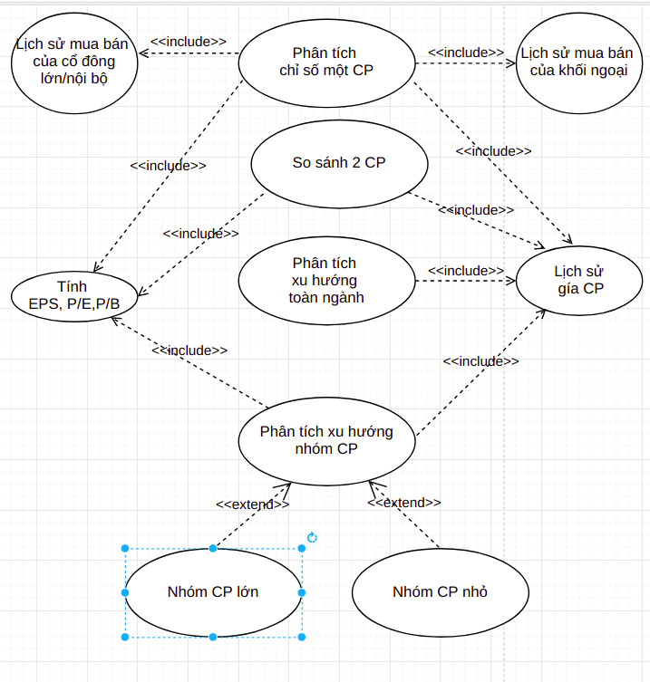
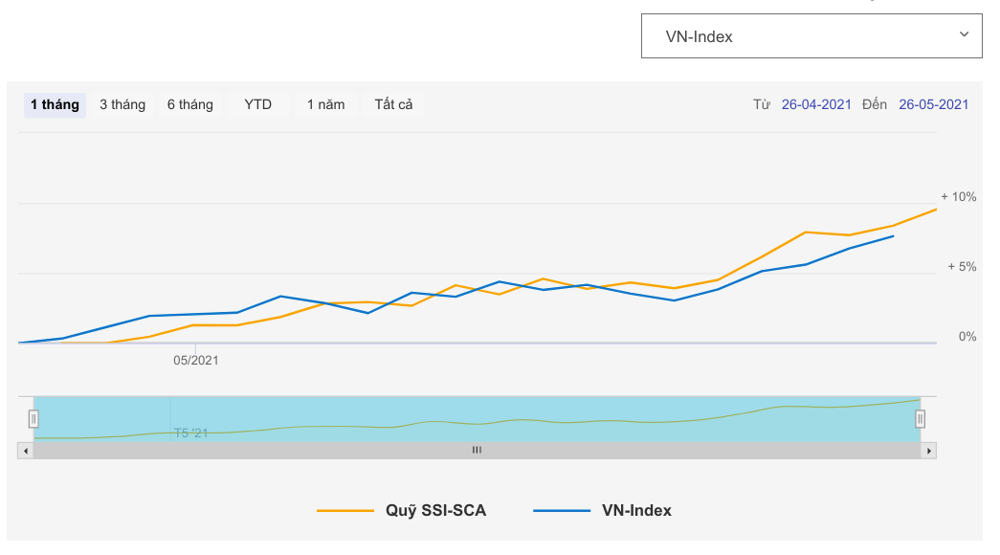
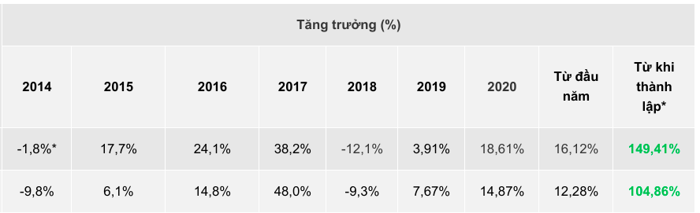

# THÔNG TIN ĐỒ ÁN MÔN BUSSINESS INTELLIGENCE

## Thành viên:

+ Huỳnh Lâm Phú Sỹ
+ Trần Đình Lâm

____
____

# I. Đặt vấn đề:

## Tên đề tài:

### Xây dựng hệ thống hỗ trợ tư vấn đầu tư chứng khoán, dựa trên dữ liệu chứng khoán Việt Nam

## Vai trò của  người sử dụng hệ thống:

### Bộ phận phân tích, tư vấn đầu tư của một quỹ đầu tư chứng khoán

## Nghiệp vụ:

+ Tính toán, Phân tích các chỉ số cơ bản của một cổ phiếu/ nhóm cổ phiếu
+ Phân tích xu hướng tăng giảm của một nhóm cổ phiếu ngành (Ngân hàng, xây dựng, bất động sản, tiêu dùng,bảo hiểm,
  CNTT,...)
+ Phân tích xu hướng tăng giảm của nhóm cổ phiếu gía cao (bluechip)
+ Phân tích xu hướng tăng giảm của nhóm cổ phiếu gía thấp (penny)
+ So sánh 2 cổ phiếu khác nhau theo một số tiêu chí như giá, EPS, P/E, tỉ lệ tăng giảm gần đây, tỉ lệ tăng giảm từ đầu
  năm

## Dữ liệu dự kiến thu thập được:

+ Dữ liệu lịch sử biến động giá của từng cổ phiếu trên 2 sàn HSX và HNX thống kê mỗi ngày từ năm 2003 (cophieu68.vn),
  định dạng file txt hoặc csv
+ Dữ liệu giá của từng cổ phiếu trên 2 sàng HSX và HNX theo từng ngày (cophieu68.vn), định dạng file txt hoặc csv
+ Dữ liệu mua/bán cổ phiếu của khối ngoại đối với từng cổ phiếu theo ngày (cafef.vn), định dạng table, chưa tìm được
  cách download
+ Dữ liệu giao hàng ngày của các cổ đông lớn/nội bộ của công ty (stockbiz.vn)
+ Thông tin tên công ty, loại ngành, thuộc sàn, Khối lượng đã niêm yết,... của từng mã cổ phiếu (finance.vietstock.vn)
+ ....

**Note:**

+ Các dữ liệu của các nhà cung cấp chủ yếu ở dạng format đầu vào cho các phần mềm phân tích chứng khoán chuyên dụng (
  Metastock,AmiBroker,...) nên khá chi tiết theo ngày
+ Dữ liệu có thể được export thành file excel được cung cấp sẵn, có thể sử dụng để làm đầu vào cho datasource hoặc là
  datasource theo dạng file
+ Dữ liệu có thể lấy được bằng API mà trang web đó đang sử dụng
+ Dữ liệu không được tổng hợp theo file, thì có thể được lưu thủ công bằng tay trong khoảng thời gian ngắn gần đây

____

# Tài liệu tham khảo:

+ https://s.cafef.vn/TraCuuLichSu2/3/HOSE/21/05/2021.chn
+ https://www.cophieu68.vn/export.php
+ https://nududo.com/top-4-du-lieu-chung-khoan-hang-ngay
+ https://www.stockbiz.vn/InsiderActionsStats.aspx
+ https://finance.vietstock.vn/
+ http://s.cafef.vn/screener.aspx

____
____

# II. Phân tích nghiệp vụ:
+ Link vẽ mô hình trong phân tích nghiệp vụ: 
  + https://drive.google.com/file/d/1loTjNS5HTa3zzTyr_Leg520H-Yr2XpaR/view?usp=sharing
    
### II.1: _Nghiệp vụ Tính toán, Phân tích các chỉ số cơ bản của một cổ phiếu/ nhóm cổ phiếu:_

Trong nghiệp vụ phân tích chứng khoán, các chỉ số cơ bản của một cổ phiếu hay một loại cổ phiếu là các thông tin đầu
tiên cần phải nắm bắt. Trong phương pháp phân tích cơ bản, các nhóm chỉ số sau đây thường được các phân tích viên sử
dụng nhiều nhất:

+ Nhóm hệ số giá trị: Chỉ số EPS (Earning per Stock)
    + EPS – Thu nhập trên một Cổ phiếu: là chỉ số cho biết khả năng sinh lợi của Công ty trên một đơn vị cổ phần  
        + EPS = (∑ thu nhập sau thuế - ∑ số cổ tức của Cổ phiếu ưu đãi)/ ∑ số Cổ phiếu đang lưu hành  
        + › Nếu chỉ số EPS càng cao thì nó càng cho thấy khả năng sinh lời của Công ty càng lớn và ngược lại.
        + › So sánh chỉ số EPS qua các thời kỳ sẽ giúp chúng ta biết được tốc độ tăng trưởng của doanh nghiệp đang phân
          tích.
    + Chỉ số P/E (Price per earning)  = Giá hiện tại của Cổ phiếu/ EPS
        + là tỉ lệ giá trên thu nhập
        + Cho biết mức độ đánh giá, sẵn sàng trả giá cho cổ phiếu đó trên thị trường.
    + Chỉ số P/B Chỉ số Giá/Giá trị sổ sách (Price-to-Book ratio, P/B Ratio)
        + Chỉ số này giúp xác định mức độ đánh giá của thị trường đối với khả năng sinh lời của công ty đó.
+ Ngoài ra còn một số chỉ số cơ bản khác phục vụ cho quá trình phân tích nêu trên (có thời gian sẽ mô tả chi tiết hơn)

### Sơ đồ case-study:

### Đặc tả chi tiết case-study:

+ #### Mục đích:
  Thông qua các chỉ số cơ bản, xác định được giá cả của một cổ phiếu là đắt hay rẻ so với thị trường
+ #### Thông tin đầu vào:
    + Thông tin tổng số cổ phiếu lưu hành của từng công ty
    + Thông tin thị giá hiện tại (và có thể là quá khứ) của các cổ phiếu
    + Thông tin chỉ số EPS hiện tại của các cổ phiếu
+ #### Kết quả đầu ra:
    + Chỉ số P/E của từng cổ phiếu
    + Phân bổ chỉ số P/E của toàn thị trường
    + Xác định một cổ phiếu bất kỳ thuộc mức độ nào trên thị trường
    + Xác định một cổ phiếu bất kỳ thuộc mức độ nào trong nhóm ngành tương ứng
+ #### Ý nghĩa rút trích được từ đầu ra:
    + Nếu chỉ số P/E cao hơn trung bình chung toàn thị trường hoặc trung bình chung toàn ngành, tức cổ phiếu đang được
      kỳ vọng, nên đang được định giá cao, giá đang đắt
    + Nếu chỉ số P/E tương đối thấp hoặc ngang mức trung bình, nghĩa là cổ phiếu đang ít được kỳ vọng, nên giá đang rẻ
    + Thông qua phân tích này, ta có thể tư vấn việc lựa chọn đầu tư vào cổ phiếu giá rẻ hoặc giá đắt, phụ thuộc vào
      chiến lược đầu tư của khách hàng/Quỹ đầu tư đang chọn.

_____

### II.2: _Nghiệp vụ So sánh 2 cổ phiếu khác nhau theo một số tiêu chí_

+ Minh họa so sánh:
  

+ So sánh giá trị và sự khác nhau, giống nhau giữa 2 hay nhiều cổ phiếu là nghiệp vụ quan trọng giúp nhà đầu tư cân nhắc
  và đối sánh các cổ phiếu với nhau, từ đó ra quyết định khi có sự phân vân giữa các loại cổ phiếu.

+ Thông thường, các chỉ số cần so sánh với nhau bao gồm 2 nhóm: chỉ số cơ bản và chỉ số kỹ thuật
    + Chỉ số cơ bản: EPS, P/E, P/B
    + Chỉ số kỹ thuật:
        + Tương quan biến động giá trong tuần/tháng/3 tháng/6 tháng gần nhất
        + Tương quan tăng trưởng tổng thể sau các năm, ví dụ:
          

+ #### Thông tin đầu vào:
    + Thông tin chỉ số EPS, P/E, P/B hiện tại của 2 cổ phiếu
    + Lịch sử biến động giá của 2 cổ phiếu từ khi lên sàn
+ #### Kết quả đầu ra:
    + Tương quan Chỉ số P/E, EPS,... thể hiện dưới dạng biểu đồ cột hoặc dòng ngang (Bar chart)
    + Tương quan tăng trưởng tổng thể sau các năm như ví dụ trên, thể hiện ở dạng bảng hoặc dạng Bar chart
    