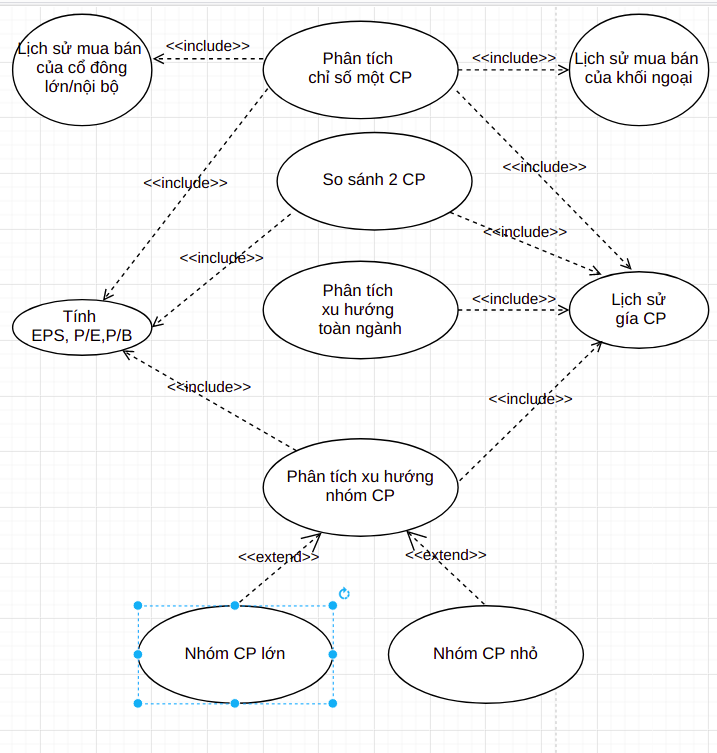

# II. Phân tích nghiệp vụ:

+ Link vẽ mô hình trong phân tích nghiệp vụ:
    + https://drive.google.com/file/d/1loTjNS5HTa3zzTyr_Leg520H-Yr2XpaR/view?usp=sharing
      

### II.1: _Nghiệp vụ Tính toán, Phân tích các chỉ số cơ bản của một cổ phiếu/ nhóm cổ phiếu:_

Trong nghiệp vụ phân tích chứng khoán, các chỉ số cơ bản của một cổ phiếu hay một loại cổ phiếu là các thông tin đầu
tiên cần phải nắm bắt. Trong phương pháp phân tích cơ bản, các nhóm chỉ số sau đây thường được các phân tích viên sử
dụng nhiều nhất:

+ Nhóm hệ số giá trị: Chỉ số EPS (Earning per Share)
    + EPS – Thu nhập trên một Cổ phiếu: là chỉ số cho biết khả năng sinh lợi của Công ty trên một đơn vị cổ phần  
        + EPS = (∑ thu nhập sau thuế - ∑ số cổ tức của Cổ phiếu ưu đãi)/ ∑ số Cổ phiếu đang lưu hành  
        + › Nếu chỉ số EPS càng cao thì nó càng cho thấy khả năng sinh lời của Công ty càng lớn và ngược lại.
        + › So sánh chỉ số EPS qua các thời kỳ sẽ giúp chúng ta biết được tốc độ tăng trưởng của doanh nghiệp đang phân
          tích.
    + Chỉ số P/E (Price per earning)  = Giá hiện tại của Cổ phiếu/ EPS
        + là tỉ lệ giá trên thu nhập
        + Cho biết mức độ đánh giá, sẵn sàng trả giá cho cổ phiếu đó trên thị trường.
    + Chỉ số P/B Chỉ số Giá/Giá trị sổ sách (Price-to-Book ratio, P/B Ratio)
        + Chỉ số này giúp xác định mức độ đánh giá của thị trường đối với khả năng sinh lời của công ty đó.
+ Ngoài ra còn một số chỉ số cơ bản khác phục vụ cho quá trình phân tích nêu trên (có thời gian sẽ mô tả chi tiết hơn)

### Sơ đồ case-study:

### Đặc tả chi tiết case-study:

+ #### Mục đích:
  Thông qua các chỉ số cơ bản, xác định được giá cả của một cổ phiếu là đắt hay rẻ so với thị trường
+ #### Thông tin đầu vào:
    + Thông tin tổng số cổ phiếu lưu hành của từng công ty
    + Thông tin thị giá hiện tại (và có thể là quá khứ) của các cổ phiếu
    + Thông tin chỉ số EPS hiện tại của các cổ phiếu
+ #### Kết quả đầu ra:
    + Chỉ số P/E của từng cổ phiếu
    + Phân bổ chỉ số P/E của toàn thị trường
    + Xác định một cổ phiếu bất kỳ thuộc mức độ nào trên thị trường
    + Xác định một cổ phiếu bất kỳ thuộc mức độ nào trong nhóm ngành tương ứng
+ #### Ý nghĩa rút trích được từ đầu ra:
    + Nếu chỉ số P/E cao hơn trung bình chung toàn thị trường hoặc trung bình chung toàn ngành, tức cổ phiếu đang được
      kỳ vọng, nên đang được định giá cao, giá đang đắt
    + Nếu chỉ số P/E tương đối thấp hoặc ngang mức trung bình, nghĩa là cổ phiếu đang ít được kỳ vọng, nên giá đang rẻ
    + Thông qua phân tích này, ta có thể tư vấn việc lựa chọn đầu tư vào cổ phiếu giá rẻ hoặc giá đắt, phụ thuộc vào
      chiến lược đầu tư của khách hàng/Quỹ đầu tư đang chọn.
+ #### Mô tả chi tiết nghiệp vụ
  Bước 1: Tính toán hoặc thu thập các chỉ số cơ bản:
  Bước 2: Từ thông tin thu thập được của cổ phiếu (số lượng cổ phiếu, giá trị cổ phiếu trong ngày) tính toán chỉ số P/E
  như sau:
    + P/E = giá thị trường / EPS, giá trị này được tính tại mỗi bước nạp dữ liệu từ nguồn vào warehouse
    + ROA = lợi nhuận dành cho cổ động / Tổng tài sản công ty
    + ROE = lợi nhuận dành cho cổ động / vốn cổ phần thường Bước 3: Phân loại cổ phiếu: thực hiện phân loại cổ phiếu dựa
      trên các yếu tố như sau:
    + Dựa theo thông tin vốn hoà thị trường: theo cách phân tích này, các cổ phiếu sẽ được phân loại dựa theo giá vốn
      hoá của nó, cụ thể như sau:

  |Nhóm cổ phiếu|Tên tiếng anh|Tên khác| Vốn hoá thị trường|
      |-------------|-------------|--------|-------------------|
  |Vốn hoá lớn|Large Cap|Bluechip|MKC>10.000 tỷ đồng|
  |Vốn hoá vừa|Mid Cap||1000<MKC<=10000 tỷ đồng|
  |Vốn hoá nhỏ|Small Cap|Penny|100<MKC<1000 tỷ đồng|
  |Vốn hoá siêu nhỏ|Micro Cap| Hàng dế| MKC<=100 tỷ đồng|
  Bước 4: Đánh giá cổ phiếu: để đánh giá cổ phiếu sẽ thực hiện tính toán các chỉ số ở bước 2 đối với các các cổ phiếu ở
  cùng lĩnh vực để so sánh mức giá cũng như lấy lại các giá trị đó trong quá khứ để theo dõi sự biến đổi để tìm quy luật
  thay đổi của loại cổ phiếu này.

_____

### II.2: _Nghiệp vụ So sánh 2 cổ phiếu khác nhau theo một số tiêu chí_

+ Minh họa so sánh:
  

+ So sánh giá trị và sự khác nhau, giống nhau giữa 2 hay nhiều cổ phiếu là nghiệp vụ quan trọng giúp nhà đầu tư cân nhắc
  và đối sánh các cổ phiếu với nhau, từ đó ra quyết định khi có sự phân vân giữa các loại cổ phiếu.

+ Thông thường, các chỉ số cần so sánh với nhau bao gồm 2 nhóm: chỉ số cơ bản và chỉ số kỹ thuật
    + Chỉ số cơ bản: EPS, P/E, P/B
    + Chỉ số kỹ thuật:
        + Tương quan biến động giá trong tuần/tháng/3 tháng/6 tháng gần nhất
        + Tương quan tăng trưởng tổng thể sau các năm, ví dụ:
          

+ #### Thông tin đầu vào:
    + Thông tin chỉ số EPS, P/E, P/B hiện tại của 2 cổ phiếu
    + Lịch sử biến động giá của 2 cổ phiếu từ khi lên sàn
+ #### Kết quả đầu ra:
    + Tương quan Chỉ số P/E, EPS,... thể hiện dưới dạng biểu đồ cột hoặc dòng ngang (Bar chart)
    + Tương quan tăng trưởng tổng thể sau các năm như ví dụ trên, thể hiện ở dạng bảng hoặc dạng Bar chart
<<<<<<< Updated upstream
+ #### Mô tả chi tiết nghiệp vụ
    + Bước 1: thu thập kết quả quả trên
    + Bước 2: Sắp xếp các chỉ số theo nhóm để vẽ đồ thị biểu diễn
    + Bước 3: Biểu diễn các nhóm đó theo các loại đồ thị khác nhau

### II.3 Nghiệp vụ phân tích danh mục đầu tư

+ #### Giới thiệu:
+ Khi một nhà đầu tư quyết định đầu tư vào thị trường chứng khoán, họ cần các lời khuyên để bắt đầu thực hiện đầu tư. Do
  đó việc thu thập thông tin từ người cần đầu tư để tư vấn đầu tư là một chức năng quan trọng trong tư vấn chứng khoán.

+ Để có thể tư vấn danh mục đầu tư chứng khoán, ta cần thu thập các thông tin sau từ khách hàng như:
    + Xác định mục tiêu đầu tư: số tiền đầu tư ban đầu, số tiền đầu tư định kì, khẩu vị rủi ro (mức độ chấp nhận rủi ro
      để đầu tư)
    + Xác định chiến lược đầu tưc của mình bao gồm các tiêu chuẩn và phân bổ đầu tư
    + Giám sát, theo dõi diễn biến trên thị trường đầu tư chứng khoán
    + Điều chỉnh danh mục đầu tư để phù hợp với tình hình thực tế

+ Lợi ích khi quản lí danh mục đầu tư chứng khoán:
    + tối ưu hoá lợi nhuận và hạn chế rủi ro
    +

+ Thông thường để lập danh mục đầu tư, các chuyên gia thường chia thành các mục sau:
    + Danh mục đầu tư mạo hiểm: Danh mục này thường chứa những tài sản, cổ phiếu rủi ro cao nhưng tỷ suất lợi lớn. Cổ
      phiếu trong danh mục này rất nhạy cảm với biến động với thị trường hoặc có chỉ số Beta cao. Chỉ số beta ở đây
      chính là chỉ số đo lường rủi ro.
    + Danh mục đầu tư an toàn: Ngược lại với mạo hiểm là an toàn. Các cổ phiếu này thường không phụ thuộc vào biến động
      thị trường và có chỉ số Beta thấp. Tuy nhiên những cố phiếu này thường sẽ nhạy cảm với sự biến đổi theo chu kỳ
      kinh tế. Tức là khi nền kinh tế có biến động thì các cổ phiểu này sẽ biến động theo đúng chiều của nền kinh tế.
    + Danh mục đầu tư theo thu nhập: Dễ hiểu nhất với danh mục này chúng ta cứ tưởng tượng đến việc nhận cổ tức hay gửi
      tiết kiệm ngân hàng. Danh mục đầu tư theo thu nhập có phần giống với danh mục đầu tư an toàn tuy nhiên nó lại có
      khả năng kếm lợi nhuận tốt hơn. Và đặc biệt là danh mục này có thể tạo được dòng tiền dương cho nhà đầu tư. Tuy
      nhiên lưu ý rằng, danh mục đầu tư theo thu nhập cũng phụ thuộc và tình hình kinh tế.
    + Danh mục đầu tư đầu cơ: Danh mục đầu tư đầu cơ là danh mục chứa đựng nhiều rủi ro. Nó cũng khá giống với danh mục
      đầu tư mạo hiểm. Thông thường ở danh mục này nhà đầu tư sẽ đầu cơ các đợt phát hành cổ phiếu lần đầu (ICO) hoặc
      những cố phiếu nhỏ đang được đồn đại về tiềm năng. Danh mục đầu cơ cũng có chứng khoán phái sinh CFD. Lợi nhất rất
      cao của CFD do có đòn bẩy linh hoạt chính là lý do khiến nó được xếp vào danh mục này.
    + Danh mục đầu tư hỗn hợp: Danh mục đầu tư hỗn hợp có cách tiếp cận rất linh hoạt. Đáng chú ý là danh mục này sẽ có
      cự phân phối tương đối cố định giữa trái phiếu và cổ phiếu. Thường mạo hiểm kết hợp nhiều lĩnh vực khác nhau với
      nhiều loại cổ phiếu khác nhau để tối đa hóa các ưu điểm hiện có của chúng như bất động sản, nghệ thuật, trái
      phiếu, blue-chip, REITs và cả MLPs,….

+ #### Thông tin đầu vào:
    + Thông tin nhà đầu tư, mong muốn đầu tư, khẩu vị rủi ro
    + Các thông tin, chỉ số chứng khoán cơ bản hoặc đã tính toán ở các nghiệp vụ trên (EPS, ROE, ROA, chỉ số beta,...)
    + Lịch sử của các giao dịch trên
+ #### Thông tin đầu ra:
    + Bảng phân tích danh mục đầu tư theo yêu cầu của nhà đầu tư bao gồm các nhóm cổ phiếu theo danh mục bao gồm các
      nhóm cổ phiếu an toàn, mạo hiểu đầu cơ, ... và vốn đầu tư cho mỗi danh mục tuỳ thuộc vào

+ #### Các bước thực hiện:
    + Bước 1: Tính toán vốn đầu tư của nhà đầu tư theo các giá khẩu vị rủi ro của họ, chia vốn của nhà đầu tư thành các
      nhóm đầu tư mạo hiểm, an toàn, đầu cơ,...
    + Bước 2: Phân loại các nhóm cổ phiểu theo danh mục trên đã đưa ra
    + Bước 3: Đưa ra tư vấn về các loại cổ phiếu theo từng nhóm cho nhà đầu tư