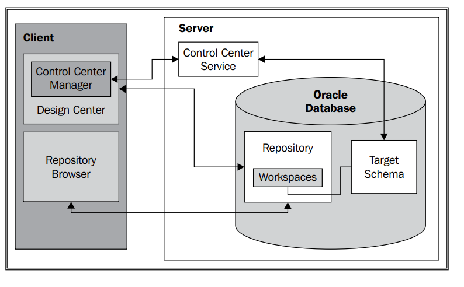

Pentaho:
https://www.ubuntupit.com/how-to-install-pentaho-data-integration-pdi-tool-on-ubuntu/

Oracle Developer Day pre-install VM:
http://praitheesh.blogspot.com/2013/10/oracle-developer-day-vm-how-to-use-pre.html

Oracle Warehouse Builder:
https://www.oracle.com/database/technologies/warehouse/downloads.html#

# Cài trên win XP:

https://www.youtube.com/watch?v=YDxA7WyhsvE&t=6s

+ The Database Control URL is https://localhost:1158/em
+ global db name: orcl
+ addmin pass: oracle
+ pass manager: oracle

<<<<<<< Updated upstream
"QM@B-cZCu?+53.

____
__Ngày 07-07-2021__

+ Project Folder:
    + C:\Users\LAP11777-local\Documents\GitHub\backup2\master_2nd_semester\BusinessIntelligence

+ computer password: Aa123456
+ oracle password: oracle
=======
____

# Data warehouse 11g windows

+ host: localhost:1521
+ SID: owb
+ account: work_owb hoặc ws_owb
+ password: oracle

Ngày truy cập gần nhất: 03/07/2021,win10 của lamtd, dùng Design Center home_4

+ Schema target: localhost:1521 WORK_OWB

____

# Docker image for oracle 11 xe

+ https://hub.docker.com/r/epiclabs/docker-oracle-xe-11g/
+ hostname: localhost
+ port: 49161
+ sid: xe
+ username: system
+ password: oracle

# Kiến trúc của OWB

+ Design Center:
    + Là Interface chính để thiết kế data warehouse
    + Định nghĩa source và target
    + Mô tả quy trình ETL
    + Định nghĩa ETL procedures

# Define Data source and target 
>>>>>>> Stashed changes
