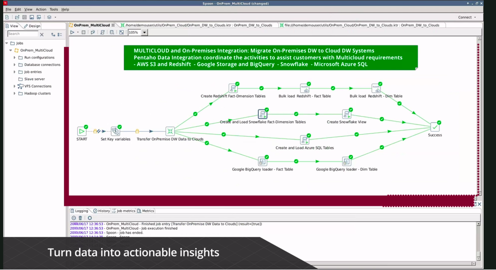

# nhật ký cài đặt pentaho

+ https://help.pentaho.com/Documentation/7.0/0F0/0P0/020/0B0
+ https://bi4vn.wordpress.com/2012/08/31/pentaho-bi/
+ https://www.vertica.com/kb/Vertica-QuickStart-for-Pentaho-Data-Integration-Linux/Content/Partner/Vertica-QuickStart-for-Pentaho-Data-Integration-Linux.htm
+ https://mondrian.pentaho.com/documentation/workbench.php
  
### link download tất cả các tools
+ https://sourceforge.net/projects/pentaho/files/Pentaho%209.1/
___
**Pentaho được gọi lại thành 1 package là BI suite trong đó có 5 module chính:**

+ Pentaho Reporting:
    + Tạo các report. Trong đó chúng ta có thể tạo report trực tiếp trên Browser bằng cách kéo thả các column hay row
      hay measure từ metadata hay cube.
    + Với cách này chúng ta chỉ có thể tạo những report đơn giản (Interactive Report)
    + Đối vơi những report phức tạp thì chúng ta phải dùng một tool khác như:
        + Report Designer
        + Design Studio.
    + Những người có kiến thức vững về Java thì nên sử dụng Design Studio
+ Pentaho Dashboard:
    + Một dashboard có thể chứa các report, cross tab, chart…
    + Đặc biệt là cho nhúng google Map vào để phân tích theo từ vùng địa lý
+ Pentaho Data Intergration:
    + Đây là một ETL (Extraction Transformation Loading) tool. Dùng để tổng hợp, chuyển đổi, xử lý dữ liệu.
    + Đây là một tool khá mạnh của pentaho.

+ Pentaho OLAP:
    + Phân tích dữ liệu dựa trên multi-dimension.
    + Với tool Schema Workbench chúng ta có thể tạo các cube theo kiểu R-OLAP.

**7 công cụ trên Client.**

+ Pentaho Report Designer: Là tool tạo các report.
+ Pentaho Design Studio: Là tool để tạo report, flashchart. giống như một framwork của Java. Nếu bạn là một người giỏi
  về Java tôi nghĩ nên tận dụng công cụ này. Bạn có thể add các plugin hay các component vào
+ Pentaho Metadata Editor: Là tool để tạo metadata. Metadata là kiểu dữ liệu gói được tạo từ star schema. Sau khi tạo
  xong chúng ta có thể public để user có thể dể dàng tạo report từ browser bằng việc kéo thả.
+ Pentaho Schema Workbench:(Modrian) Là công cụ tạo cube theo kiểu OLAP. Sau đó Public lên server để user dễ dàng sử
  dụng để phân tích.
+ Pentaho Aggregate Designer: Là cộng cụ hỗ trợ cho Schema Workbench để tạo cube
+ Pentaho Data Intergration: là tool ETL như giới thiệu ở trên.
+ Pentaho Data Mining: Sử dụng WEKA để xử lý dữ liệu.

