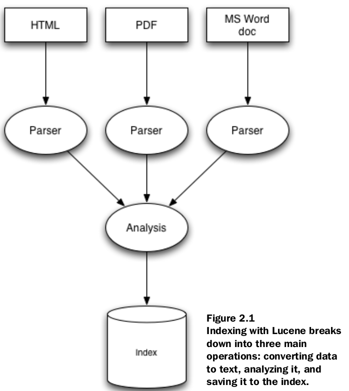
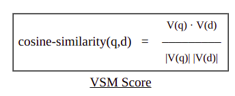
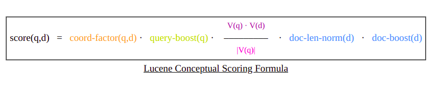
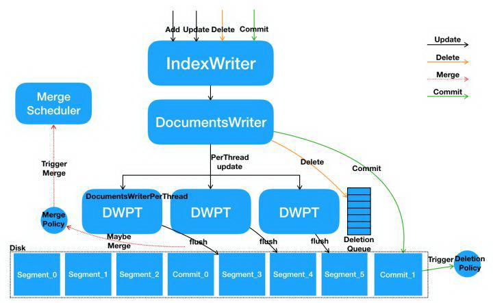
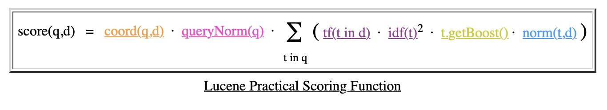
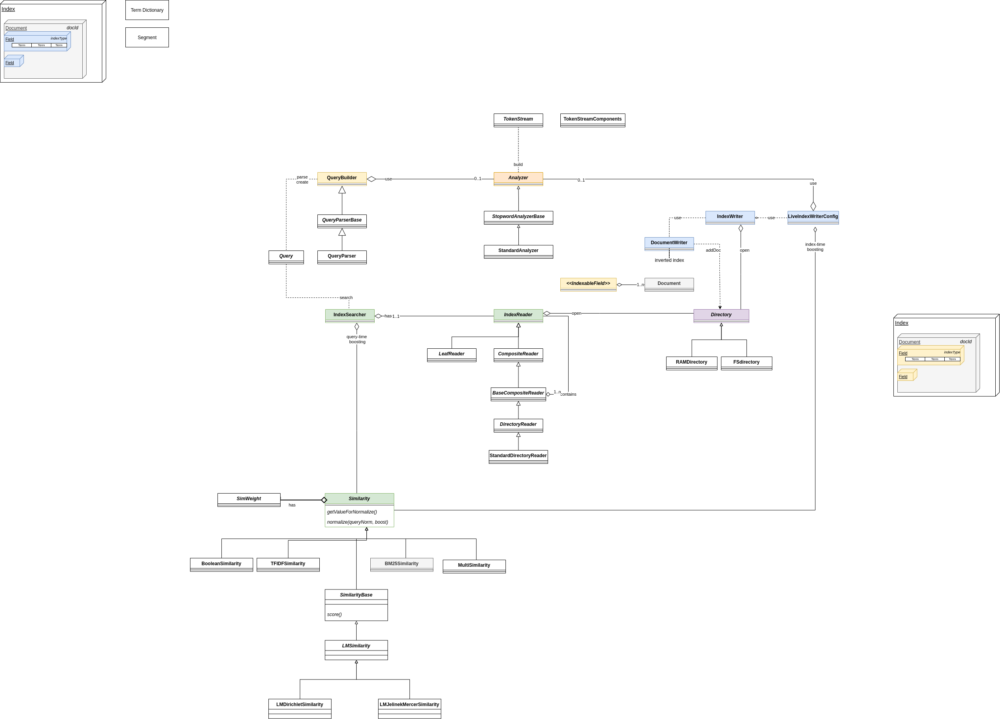
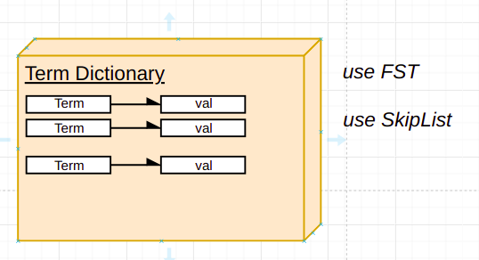
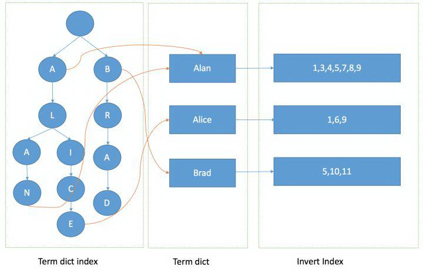

# Phần 2: Mô hình

## 2.1 Mô hình trừu tượng, concept

### information indexing

### information retrieval

## Similarity:

+ https://lucene.apache.org/core/3_0_3/api/core/org/apache/lucene/search/Similarity.html#formula_norm
+ https://lucene.apache.org/core/6_6_0/core/org/apache/lucene/search/similarities/

+ Đây là các class định nghĩa các thành phần tính điểm tương đồng trong Lucene:

### TFIDFSimilarity:

+ Lucene kết hợp Boolean model và Vector Space Model: document chọn bởi BM sẽ được tính điểm bởi VSM
+ document và query được biểu diễn dưới dạng vector trọng số trong không gian nhiều chiều, mỗi term là một chiều, và
  trọng số là giá trị tf-idf
+ Gọi term t và document/query x, ta có Tf(t,x)xidf(t) là trọng số trên mỗi chiều của vector V(q) và V(d). Ta tính điểm
  giữa document d và query q bằng Cosine Similarity.
  

+ Lucene tinh chế lại điểm VSM cho cả quality (chất lượng) và usability (khả năng sử dụng)
+

### Lucene's Conceptual Scoring Formula

+ Công thức tính điểm tổng quát của Lucene

### Lucene's Practical Scoring Function

____

## 2.2 Mô hình cài đặt vật lý bằng Java

### Các thành phần chính trong Indexing:

+ IndexWriter:
    + Là thành phần trung tâm của quá trình index, đảm nhiệm việc tạo index và đưa document vào index
+ Directory:
    + Thành phần abstract quản lý nơi lưu trữ các index file. Một số cài đặt cụ thể:
        + FSDirectory
        + RAMDirectory

+ Analyzer:
    + Trước khi text được index, sẽ được qua một bộ Analyzer. Bộ này trích xuất các token ra khỏi text, giữ lại các
      token và loại bỏ các phần khác.
    + Ví dụ điển hình của Analyzer là loại bỏ các "stop word".
+ Document:
    + Là tập hợp các fields, thể hiện cho một đoạn (chunk) của dữ liệu ta muốn tìm kiếm.
+ Field:
    + Keyword
    + UnIndexed
    + UnStored
    + Text

#### IndexingChain

#### Sử dụng Document Boosting để thể hiện tầm quan trọng của document

+ Index-time boosting
+ Query-time boosting

____

### Các thành phần chính trong Searching:

+ IndexSearcher:
    + Dùng để load và đọc index lên
+ Term:
    + Là đơn vị cơ bản nhỏ nhất của quá trình search
+ Query:
    + TermQuery
    + BooleanQuery
    + PhraseQuery
    + PrefixQuery
    + PhrasePrefixQuery
    + RangeQuery
    + FilteredQuery
    + SpanQuery
+ Hits: Lưu chứa một đoạn kết quả trả về (đã được ranking)

### Sử dụng Term vector

+ Term Frequency Vector

### Segment:

+ Lucene sau khi nhận dữ liệu, index sẽ được generate vào cache, sau đó định đưa vào Segment, lúc này Segment có thể
  được sử dụng ngay. Điều này làm cho Lucene xử lý gần như real time.

### Index Type

+ stored: Loại index này lưu trữ toàn bộ input thành văn bản
+ tokenized: kết quả của mỗi từ được xem như một term (là key) gắn với các Document (inverted index)
+ termVector: đánh dấu mỗi term bằng bộ 3 {term value, frequencies, position}. Dành cho keyword highlighting và
  similarity matching.
+ omitNorm: tính ra hệ số tương quan. Mỗi document sẽ được tính và lưu riêng biệt. This saves memory, but at the expense
  of scoring quality (length normalization will be disabled), and if you omit norms, you cannot use index-time boosts.

+ indexOptions: các option cho việc lưu trữ inverted index
    + NONE: Nothing saved
    + DOCS: stores only DocId
    + DOCS_AND_FREQS: storing DocId AND FREQUENCY (Term Freq)
    + DOCS_AND_FREQS_AND_POSITIONS: storage doc_id, term frequency (Term Freq) and a position
    + DOCS_AND_FREQS_AND_POSITIONS_AND_OFFSETS: storage doc_id, term frequency (Term Freq), position and offset (offset)

+ docValuesType
+ dimension

## Similarity:

https://lucene.apache.org/core/3_0_3/api/core/org/apache/lucene/search/Similarity.html#formula_norm

+ Đây là class định nghĩa các thành phần tính điểm tương đồng trong Lucene:

### VSM Score:

+ Lucene kết hợp Boolean model và Vector Space Model: document chọn bởi BM sẽ được tính điểm bởi VSM
+ document và query được biểu diễn dưới dạng vector trọng số trong không gian nhiều chiều, mỗi term là một chiều, và
  trọng số là giá trị tf-idf
+ Gọi term t và document/query x, ta có Tf(t,x)xidf(t) là trọng số trên mỗi chiều của vector V(q) và V(d). Ta tính điểm
  giữa document d và query q bằng Cosine Similarity.
  

### Lucene's Conceptual Scoring Formula

Các thành phần trong công thức trên:

- coord-factor(q,d): hệ số phối hợp - một tài liệu có thể khớp với một hoặc nhiều term trong câu truy vấn mà không nhất
  thiết phải chứa tất cả các term của câu truy vấn. Do đó ngừoi dùng có thể thưởng thêm cho tài liều mà khớp nhiều query
  term hơn thông qua hệ số này.
- query-boost(q): Tại thừoi điểm tìm kiếm, user có xác định chỉ số boost cho mỗi query, term và sub-query trong truy vấn
  đó. Mức đóng góp của cụm từ vào điểm của tài liệu được nhân với chỉ số này.
- doc-boost(d): Khi lập chỉ mục thì người dùng có thể chỉ định tài liệu nào qua trọng hơn những tài liệu khác bằng các
  sử dụng giá trị doc-boost(d). Điểm của tài liệu sẽ được nhân với giá trị doc-boost(d) của tài liệu đó.
- doc-len-norm(d): Chuẩn hoá tài liệu thành vector đơn vị có vấn đề là nó sẽ loại bỏ tất cả các thông tin về độ dài tài
  liệu. Đối với một vài tài liệu thì việc này sẽ ít ảnh hưởng, ví dụ một tài liệu được tạo ra bằng cách sao chép một
  đoạn văn bản nhất định 10 lần, đặc biệt là đối với các đoạn văn có nhiều từ đặc biệt. Nhưng với các văn bản khác, điều
  này có thể gây sai. Để hạn chế vấn đề này, hệ số chuẩn hoá được sử dụng để chuẩn hoá một vector lớn hơn hoặc bằng một
  vector đơn vị

### Lucene's Practical Scoring Function

Trong công thưc này ta có:

- tf(t in d): term's frequency được tính bởi công thức
- idf(t): inverse document frequency được tính bởi công thức
- coor(d,q): là thành phần điểm dựa trên bao nhiêu query-term được tìm thấy trong tài liệu.
- querryNorm(q): hệ số chuẩn hoá được sử dụng để so sánh điểm số giữa các truy vấn. Nó không ảnh hưởng đến xếp hạng tài
  liệu mà nó làm cho điểm từ các truy vấn khác nhau với các chỉ mục khác nhau có thể so sánh được. Nó được tính toán bởi
  công thức sau
- t.getBoost(): là chỉ số boost của term t trong query q (được đặc tả trong query text) hoặc được set bởi ứng dụng gọi
  setBoost().
- norm (t,d): tập hợp lại một vài thành phần boost và độ dài văn bản:
    + documentBoost: được set bởi doc.setBoost() trước khi thêm văn bản vào index
    + fieldBoost: được set bởi field.setBoost() trước khi thêm field vào văn bản
    + lengthNorm(field): được tính toán khi tài liệu được thêm vào index sao cho phù hợp với

_______

## Lucene Query Parser

Lucene là một framework, nó cung cấp khả năng để người dùng tạo query của họ thông qua các API, nó cũng cung cấp sẵn một
query language mạnh mẽ thông qua Query Parser - một bộ thông dịch từ chuỗi thành truy vấn Lucene
_____

## Cấu trúc đã vẽ

## Chi tiết về Term Dictionary

