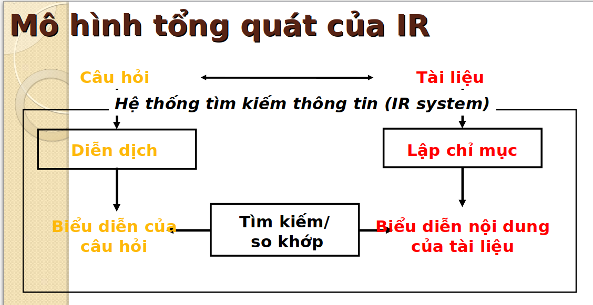
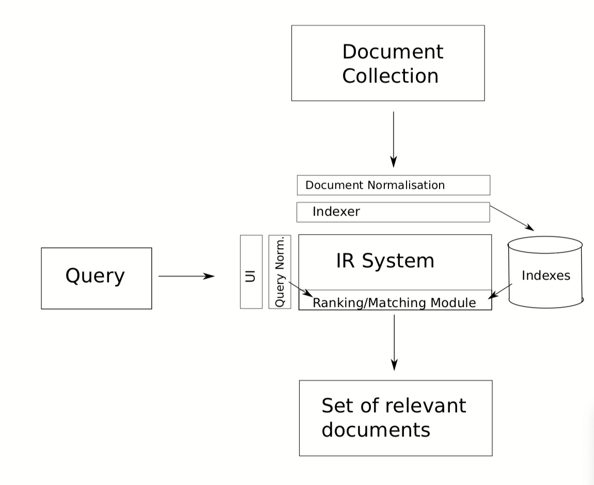

# Phần 3: Đối sánh

## Đối sánh với mô hình chuẩn

### Mô hình chuẩn

### Các thành phần tương ứng của Lucene trong mô hình chuẩn này:

+ Tập Document D(d1,d2,d3,...)

### Một số trick của Lucene khi sử dụng intevertedIndex

## Đối sánh với một mô hình tương đương

