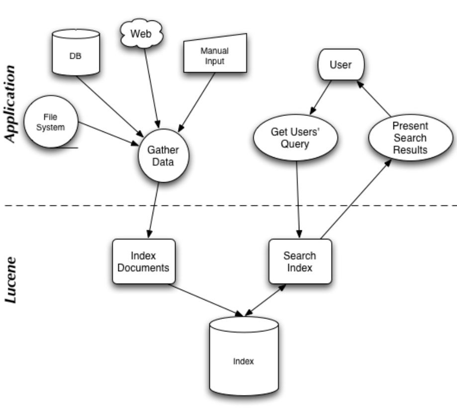
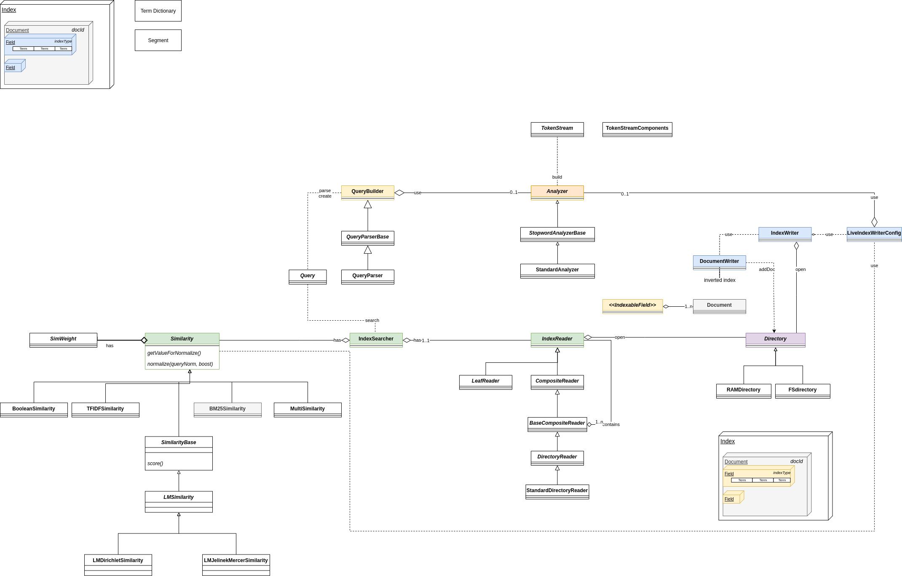
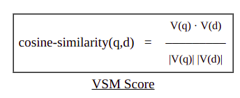
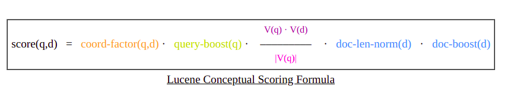

# ĐỒ ÁN TÌM HIỂU THƯ VIỆN LUCENE

## thực hiện:

+ 20C12007 - Trần Đình Lâm
+ 20C12030 - Huỳnh Lâm Phú Sĩ

## References:

+ https://www.programmersought.com/article/36231500859/
+ https://www.programmersought.com/article/6597405831/
+ https://www.programmersought.com/article/54002035220
+ https://www.programmersought.com/article/49503678348/
+ https://github.com/Apress/practical-apache-lucene-8
+ Lucene in action
+ https://en.wikipedia.org/wiki/Apache_Lucene

_______

# Phần 1: Tổng quan

## Giới thiệu Lucene

+ Apache Lucene core là một thư viện mã nguồn mở Java cung cấp các tính năng lập chỉ mục và tìm kiếm mạnh mẽ.
+ Tác giả gốc: Doug Cutting (1999) - co-founder của Apache Hadoop.
+ Là sản phẩm công nghiệp, Lucene đã chứng minh được sự ổn định cũng như thành tích đổi mới qua các phiên bản
+ Được mở rộng ra nhiều ngôn ngữ như Pascal, Perl, C#, C++, Python, Rupy, PHP.

+ Các phiên bản của Lucene: https://lucene.apache.org/core/6_6_1/changes/Changes.html
    + Release 1.0: (04-10-2000)
    + Release 2.0.0 [2006-05-26]
    + Release 3.0.0 [2009-11-25]
    + Release 4.0.0 [2012-10-12]
    + Release 5.0.0 [2015-02-20]
    + Release 6.0.0 [2016-04-08]
    + Release 6.6.0 [2017-06-06]
    + Release 7.0.0 [2017-09-20]
    + 7.7.3 ( 2020-04-28)
    + 8.8.2 (12/04/2021)
+ Lucene là core của các dự án lớn nổi tiếng như:
    + Apache Solr
    + Elastic Search (2010)
    + Apache Nutch
    + MongoDB Atlas Search

____

## Chức năng

- Định dạng index của Lucene cung cấp độc lập với ứng dụng. Nó định nghĩa tập hợp các tập tin chỉ mục dựa trên octet mà
  cho phép các hệ thống hoặc ứng dụng chạy trên các nền tảng khác nhau chia sẻ các tập tin chỉ mục này.
- Dựa trên inverted index của các công cụ full-text search truyền thống, các khối chỉ mục được cài đặt và thiết lập các
  file index nhỏ cho một file mới giúp cải thiện tốc độ đánh index. Sau đó kết hợp với chỉ mục gốc để tối ưu hoá chỉ
  mục.
- Xây dựng dựa trên kiến trúc hướng đối tượng, giúp cho việc ứng dụng Lucene dễ dàng và hỗ trợ thuận lợi cho việc mở
  rộng và cài đặt các tính năng mới.
- Bộ phân tích văn bản được cài đặt độc lập với ngôn ngữ cài đặt và định dạng tập tin. Phía lập chỉ mục tạo ra tập tin
  chỉ mục bằng cách chấp nhận một Token Stream. Ngươì sử dụng có thể sử dụng ngôn ngữ và định dạng file mới mà chỉ cần
  cài đặt interface cho bộ phân tích văn bản.
- Công cụ query mạnh mẽ được cài đặt sẵn trong Lucene. Người dùng không cần phải tự cài đặt công cụ của riêng họ. Kể cả
  khi hệ thống có được khả năng query mạnh thì Lucene vẫn có khả năng query theo các Boolean operation, fuzzy search,
  group query,...

Ngoài các chức năng chính về kĩ thuật như trên, Lucene còn có các đặc điểm khiến nó trở thành một công cụ full-text
search mạnh mẽ như:

- Nó là phần mềm mã nguồn mở theo giấp phép Apache, giúp nó không những là công cụ mà còn có thể nghiên cứu và pháp
  triển các kĩ thuật full-text search khách dựa trên nó.
- Vì được xây dựng trên lí thuyết hướng đối tượng nên nó có khả năng mở rộng to lớn. Các lập trình viên có thể dễ dàng
  sử thay đổi các component trong Lucene để cung cấp khả năng xử lí trên HTML, XML cùng các định dạng PDF khác trên
  nhiều ngôn ngữ như Tiếng Trung, Tiếng Hàn, Tiếng Pháp,...
- Đa nền tảng, cộng với sự trợ giúp của Apache Software Foundation, các lập trình viên dễ dàng giao tiếp với nhà pháp
  triển của Lucene, chia sẻ tài nguyên và giải quyết các khó khăn trong quá trình phát triển phần mềm

### Search và Index

## Đặc điểm

_______

# Phần 2: Mô hình

## 2.1 Mô hình trừu tượng, concept

### information indexing

### information retrieval

## 2.2 Mô hình cài đặt vật lý bằng Java

### Các thành phần chính trong Indexing:

+ IndexWriter:
    + Là thành phần trung tâm của quá trình index, đảm nhiệm việc tạo index và đưa document vào index
+ Directory:
    + Thành phần abstract quản lý nơi lưu trữ các index file. Một số cài đặt cụ thể:
        + FSDirectory
        + RAMDirectory

+ Analyzer:
    + Trước khi text được index, sẽ được qua một bộ Analyzer. Bộ này trích xuất các token ra khỏi text, giữ lại các
      token và loại bỏ các phần khác.
    + Ví dụ điển hình của Analyzer là loại bỏ các "stop word".
+ Document:
    + Là tập hợp các fields, thể hiện cho một đoạn (chunk) của dữ liệu ta muốn tìm kiếm.
+ Field:
    + Keyword
    + UnIndexed
    + UnStored
    + Text
      

### Các thành phần chính trong Searching:

+ IndexSearcher:
    + Dùng để load và đọc index lên
+ Term:
    + Là đơn vị cơ bản nhỏ nhất của quá trình search
+ Query:
    + TermQuery
    + BooleanQuery
    + PhraseQuery
    + PrefixQuery
    + PhrasePrefixQuery
    + RangeQuery
    + FilteredQuery
    + SpanQuery
+ TermQuery
+ Hits:
    + Lưu chứa một đoạn kết quả trả về (đã được ranking)

### Sử dụng Term vector

+ Term Frequency Vector

### Segment:

+ Lucene sau khi nhận dữ liệu, index sẽ được generate vào cache, sau đó định đưa vào Segment, lúc này Segment có thể
  được sử dụng ngay. Điều này làm cho Lucene xử lý gần như real time.

### Index Type

+ stored: Loại index này lưu trữ toàn bộ input thành văn bản
+ tokenized: kết quả của mỗi từ được xem như một term (là key) gắn với các Document (inverted index)
+ termVector: Dành cho keyword highlighting và similarity matching
+ omitNorm: This saves memory, but at the expense of scoring quality (length normalization will be disabled), and if you
  omit norms, you cannot use index-time boosts.
+ indexOptions:
    + NONE: Nothing saved
    + DOCS: stores only DocId
    + DOCS_AND_FREQS: storing DocId AND FREQUENCY (Term Freq)
    + DOCS_AND_FREQS_AND_POSITIONS: storage doc_id, term frequency (Term Freq) and a position
    + DOCS_AND_FREQS_AND_POSITIONS_AND_OFFSETS: storage doc_id, term frequency (Term Freq), position and offset (offset)

+ docValuesType
+ dimension

## Similarity:

https://lucene.apache.org/core/3_0_3/api/core/org/apache/lucene/search/Similarity.html#formula_norm

+ Đây là class định nghĩa các thành phần tính điểm tương đồng trong Lucene:

### VSM Score:

+ Lucene kết hợp Boolean model và Vector Space Model: document chọn bởi BM sẽ được tính điểm bởi VSM
+ document và query được biểu diễn dưới dạng vector trọng số trong không gian nhiều chiều, mỗi term là một chiều, và
  trọng số là giá trị tf-idf
+ Gọi term t và document/query x, ta có Tf(t,x)xidf(t) là trọng số trên mỗi chiều của vector V(q) và V(d). Ta tính điểm
  giữa document d và query q bằng Cosine Similarity.
  

### Lucene's Conceptual Scoring Formula

### Lucene's Practical Scoring Function

_______

# Phần 3: Đối sánh

## Đối sánh với mô hình chuẩn

## Đối sánh với một mô hình tương đương

_______

# Phần 4: Demo Lucene

## Demo cơ bản

## Demo nâng cao

_______

