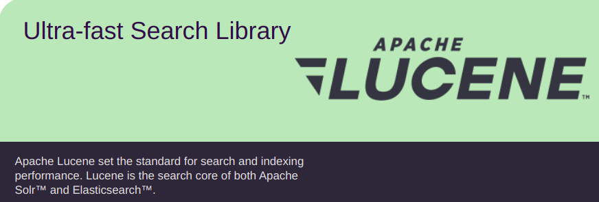

# ĐỒ ÁN TÌM HIỂU THƯ VIỆN LUCENE

## thực hiện:

+ 20C12007 - Trần Đình Lâm
+ 20C12030 - Huỳnh Lâm Phú Sĩ

## References:

+ https://www.programmersought.com/article/36231500859/
+ https://www.programmersought.com/article/6597405831/
+ https://www.programmersought.com/article/54002035220
+ https://www.programmersought.com/article/49503678348/
+ https://github.com/Apress/practical-apache-lucene-8
+ Lucene in action
+ https://en.wikipedia.org/wiki/Apache_Lucene

_______

# Phần 1: Tổng quan

## Giới thiệu Lucene

+ Apache Lucene core là một thư viện mã nguồn mở Java cung cấp các tính năng lập chỉ mục và tìm kiếm mạnh mẽ.
+ Tác giả gốc: Doug Cutting (1999) - co-founder của Apache Hadoop.
+ Là sản phẩm công nghiệp, Lucene đã chứng minh được sự ổn định cũng như thành tích đổi mới qua các phiên bản
+ Được mở rộng ra nhiều ngôn ngữ như Pascal, Perl, C#, C++, Python, Rupy, PHP.

+ Các phiên bản của Lucene: https://lucene.apache.org/core/6_6_1/changes/Changes.html
    + Release 1.0: (04-10-2000)
    + Release 2.0.0 [2006-05-26]
    + Release 3.0.0 [2009-11-25]
    + Release 4.0.0 [2012-10-12]
    + Release 5.0.0 [2015-02-20]
    + Release 6.0.0 [2016-04-08]
    + Release 6.6.0 [2017-06-06]
    + Release 7.0.0 [2017-09-20]
    + 7.7.3 ( 2020-04-28)
    + 8.8.2 (12/04/2021)
+ Lucene là core của các dự án lớn nổi tiếng như:
    + Apache Solr
    + Elastic Search (2010)
    + Apache Nutch
    + MongoDB Atlas Search

____

## Chức năng

### Search và Index

## Đặc điểm

_______

# Phần 2: Mô hình

## Mô hình trừu tượng, concept

## Mô hình cài đặt vật lý bằng Java

_______

# Phần 3: Đối sánh

## Đối sánh với mô hình chuẩn

## Đối sánh với một mô hình tương đương

_______

# Phần 4: Demo Lucene

## Demo cơ bản

## Demo nâng cao

_______

