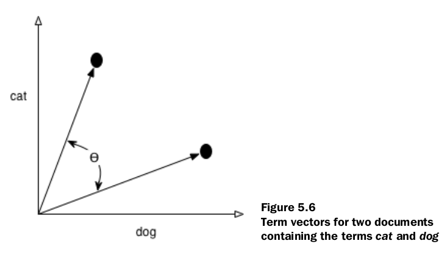

# File tổng hợp các thuật ngữ trong quá trình nghiên cứu

**Inverted Index**:

+ Là loại cấu trúc dữ liệu sử dụng dung lượng ổ đĩa một cách hiệu quả, nhưng vẫn cho phép tra cứu từ khóa nhanh chóng
+ Sử dụng các token(terms) là khóa thay vì document là khóa.
+ Trả lời cho câu hỏi "Các document nào chứa từ khóa X?"

**Full-text Search**:

+ https://en.wikipedia.org/wiki/Full-text_search
+ Là cách tìm kiếm toàn văn, tự nhiên nhất theo ngôn ngữ bình thường. FTS là một kỹ thuật tìm kiếm các tài liệu không
  phù hợp với tiêu chí tìm kiếm. Đối tượng tìm kiếm là một full-text database.
+ Kỹ thuật FTS thực hiện kiểm tra tất cả các word trong mỗi document có thể có và cố gắng match words đó với một số tiêu
  chí nhất định.

**Term vector**:
