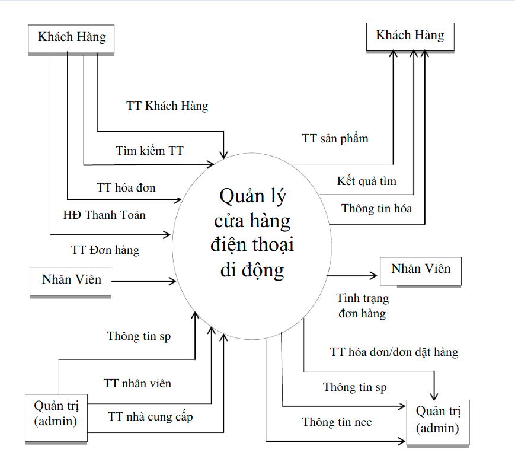
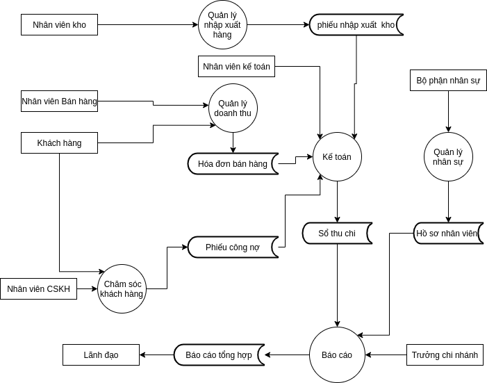
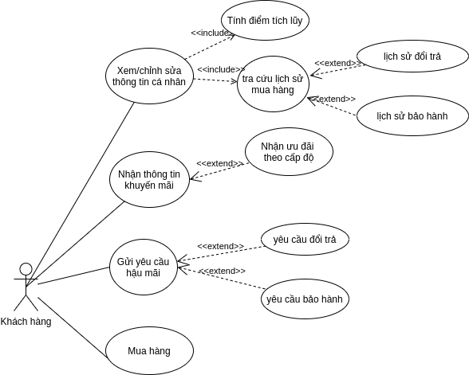
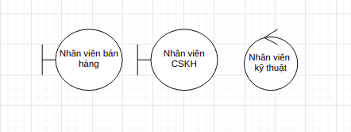
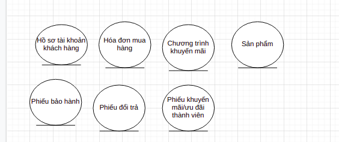
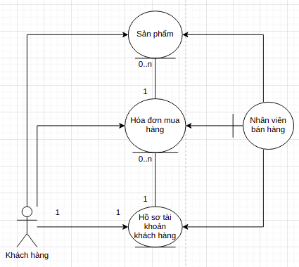
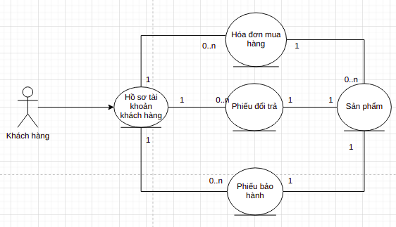
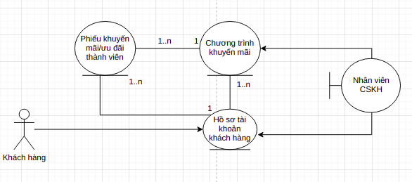
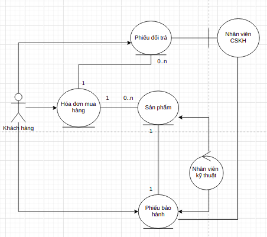

# II. Phân tích

___ 

## 1. Phân tích hiện trạng

+ Tổng quan về nghiệp vụ và phạm vi (mô tả bằng văn bản tổng quan nghiệp vụ, dung sơ đồ use case nghiệp vụ để trình bày
  đi kèm giúp cho người đọc thấy được toàn cảnh, rồi giới hạn phạm vi nghiệp vụ mà dự án tập trung vào)
+ Phân tích qui trình nghiệp vụ (ứng với từng nghiệp vụ mà dự án tập trung tin học hóa, mô tả và phân tích):
    + Mô tả bằng văn bản, mô hình hóa qui trình (dùng activity diagram, business object diagram)
    + Nêu và phân tích các vấn đề tồn tại (vd: không đồng bộ, xử lý cầu kỳ, chi phí cao, thời gian dài, …)
    + Phân tích cải tiến (có thể liên hệ các phương pháp phân tích BPA, BPI, BPR để đưa ra giải pháp cho vấn đề nêu
      trên). Vẽ lại qui trình (activity diagram) nếu qui trình nghiệp vụ thay đổi. Hiện trạng CNT T: nêu tình trạng về
      mạng, phần cứng,
+ phần mềm và phân tích khả năng đáp ứng.

___
@@@ __Nội dung:__@@@

### Tổng quan nghiệp vụ và phạm vi

#### 1. Khảo sát thực tế trên địa bàn HCM

+ Hiện nay mảng kinh doanh bán lẻ các thiết bị điện thoại di động ngày càng nở rộ để đáp ứng nhu cầu của người dùng. Khi
  công việc kinh doanh này tăng trưởng, các cửa hàng vừa và nhỏ sẽ gặp phải những khó khăn nhất định trong quá trình duy
  trì bộ máy quản lý hiện tại, cũng như tính toán chiến lược mở rộng quy mô bán hàng. Hiện nay với sự cạnh tranh gắt gao
  từ các chuỗi bán lẻ lớn nư Thegioididong, FPT, Viettel,... thì thị phần cho các cửa hàng vừa và nhỏ chỉ còn vài phần
  trăm. Vì thế yêu cầu cải tiến hệ thống để gia tăng chất lượng dịch vụ bán hàng là yêu cầu cấp thiết và sống còn đối
  với các chuỗi cửa hàng vừa và nhỏ.
+ Các chuỗi cửa hàng bán lẻ điện thoại di động trên địa bàn thành phố Hồ Chí Minh đa số đều có các nghiệp vụ cơ bản như
  sau:
    + Quản lý nhập xuất hàng (Nhập sản phẩm vào kho, xuất sản phẩm ra kho, kiểm tra chất lượng)
    + Quản lý thông tin nhân viên (nhân viên bán hàng, nhân viên giao hàng, đội ngũ kỹ thuật)
    + Quản lý khách hàng
    + Quản lý nhà cung cấp điện thoại
    + Quản lý doanh thu và công nợ (trả nợ, nhận bảo hành, trả bảo hành)
    + Kế toán

**Sơ đồ ngữ cảnh toàn bộ nghiệp vụ**

**Tham khảo**

**Vẽ lại sơ đồ DFD mức 0**

**Vẽ lại sơ đồ use case tổng quan của toàn hệ thống**

**Nhận xét**

+ Các nghiệp vụ hiện tại của doanh nghiệp chưa tập trung nhiều vào quản lý thông tin khách hàng, cũng như các quy trình
  xoay quanh quyền lợi, trải nghiệm của khách hàng. Vì vậy dự án này tập trung hướng đến cải tiến các quy trình phục vụ
  quyền lợi và trải nghiệm của đối tượng khách hàng.

#### 2. Giới hạn phạm vi nghiệp vụ mà dự án tập trung cải tiến

Phạm vi nghiệp vụ chủ yếu của dự án HTTT này là tập trung cải tiến quy trình quản lý tài khoản khách hàng, cụ thể là:

+ Quy trình mua hàng của khách hàng
+ Thông tin liên hệ của khách hàng
+ Lịch sử mua hàng của khách hàng
+ Lịch sử đổi trả, bảo hành sản phẩm của khách hàng
+ Quản lý các khuyến mãi, ưu đãi dành cho khách hàng dựa theo cấp độ

#### 3. Phân tích Qui trình nghiệp vụ

**Sơ đồ use case nghiệp vụ chăm sóc khách hàng**

Các thừa tác viên tham gia vào quy trình nghiệp vụ này bao gồm:

+ Nhân viên bán hàng
+ Nhân viên chăm sóc khách hàng
+ Nhân viên kỹ thuật

  

Các thực thể nghiệp vụ tham gia vào các nghiệp vụ này bao gồm:

+ Hồ sơ tài khoản khách hàng
+ Hóa đơn bán hàng
+ Sản phẩm
+ Phiếu đổi trả
+ Phiếu bảo hành
+ Phiếu ưu đãi/khuyến mãi

**Sơ đồ Business object Diagram cho các use case được chọn**

+ use case mua hàng:

+ use case xem thông tin cá nhân:

+ use case nhận khuyến mãi:

+ use case gửi yêu cầu hậu mãi:

**Sơ đồ Activity Diagram cho các use case được chọn**

___ 

## 2. Đánh giá khả thi (các bạn tham khảo thêm tài liệu môn học, làm tối đa có thể)

+ Khả thi kinh tế (làm rõ chi phí – lợi ích, chú ý: lợi ích là làm rõ giá trị được liệt kê ở mục 1.3)
+ Khả thi kỹ thuật
+ Hoạt động
+ Luật và hợp đồng

___ 

## 3. Kế hoạch thực hiện

___ 

## 4. Mô hình hóa phân tích hệ thống

+ Mô tả yêu cầu hệ thống
    + Liệt kê và mô tả các yêu cầu chức năng hệ thống (ứng với từng nghiệp vụ hoặc từng loại người dùng)
    + Sơ đồ use case hệ thống (system use-case)
    + Liệt kê và mô tả yêu cầu phi chức năng

+ Sơ đồ cấu trúc (analysis class diagram)

___
