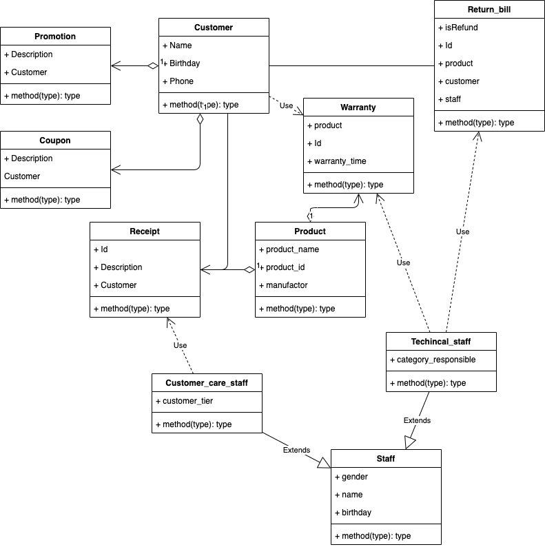
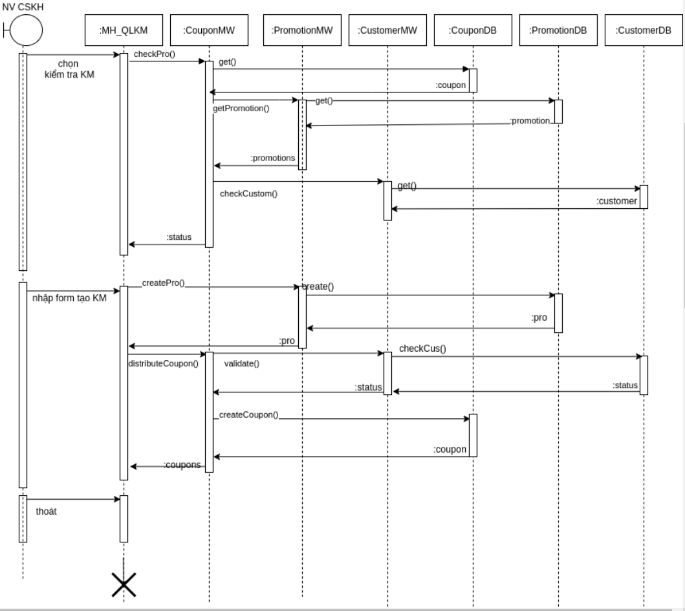

# III. Thiết kế hệ thống (phần này không bắt buộc nhưng có thể làm nếu được)

+ Thiết kế chức năng
+ Thiết kế CSDL
+ Thiết kế giao diện
+ Thiết kế kiến trúc (mô hình cơ sở hạ tầng kiến trúc và các cấu hình phần cứng/thiết bị để cài đặt và triển khai hệ
  thống. Chú ý kiến trúc phải được thiết kế đáp ứng các nhu cầu phi chức năng liên quan)

## 1. Thiết kế chức năng hệ thống

### Tiếp cận theo kiến trúc 3 tầng (three-layer):

+ Tầng giao diện
+ Tầng nghiệp vụ
+ Tầng dữ liệu

### Xác định các lớp ở tầng nghiệp vụ

### Hiện thực hóa use case bằng các sơ đồ tương tác

+ Use case "Xem thông tin cá nhân"
  
+ Use case "Xem khuyến mãi/Chương trình ưu đãi"
  
+ Use case "Gửi yêu cầu hậu mãi"
  
+ Use case "Xem yêu cầu hậu mãi"
+ Use case "Thông báo tình trạng yêu cầu hậu mãi"
  

+ Use case "Gửi thông tin chương trình khuyến mãi/ưu đãi khách hàng"
+ Use case "Kiểm tra ưu đãi/khuyến mãi khách hàng"
  

