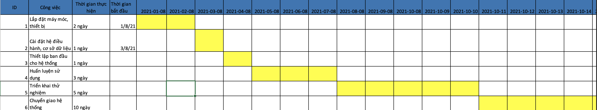

# IV. Triển khai (mô hình và kế hoạch triển khai)

1. Phương pháp cài đặt
- Hệ thống được triển khai cài đặt theo phương pháp cài đặt trực tiếp(do chưa có hệ thống tương tự được triển khai vào thời điển hiện tại)

2. Kế hoạch cài đặt
