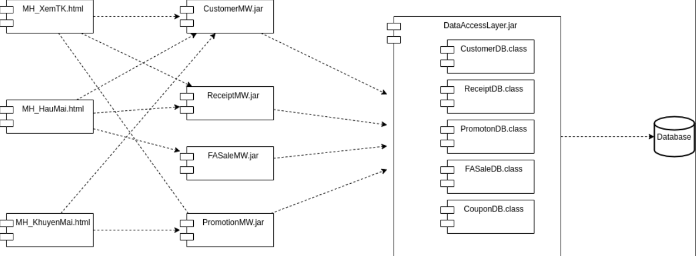
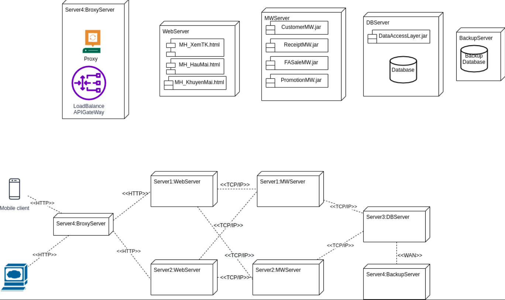
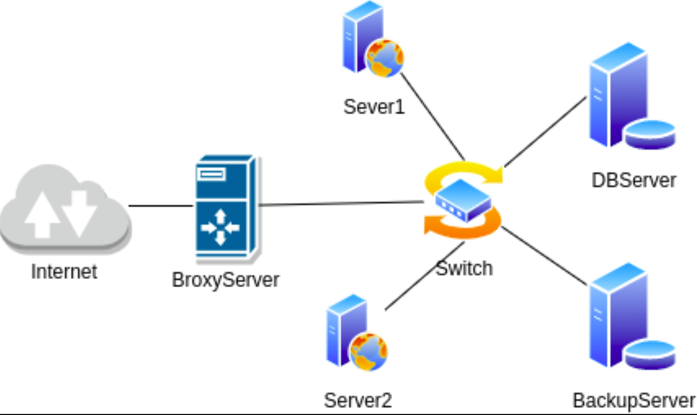

# IV. Triển khai (mô hình và kế hoạch triển khai)

# Mô hình triển khai

Lựa chon kiến trúc khách-chủ (client-server) để tối ưu hóa tính linh hoạt của hệ thống và tận dụng các thiết bị phần
cứng có sẵn của công ty.

## Sơ đồ thành phần

## Sơ đồ triển khai

## Sơ đồ mạng

___

# Kế hoạch triển khai